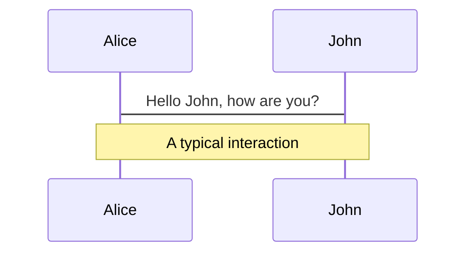
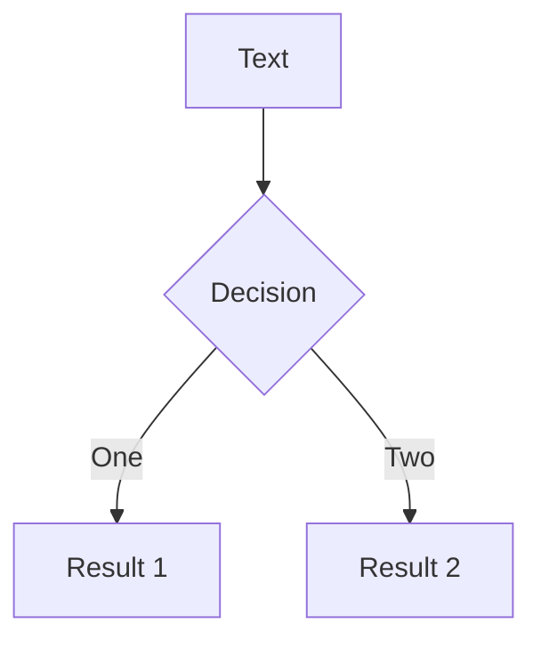
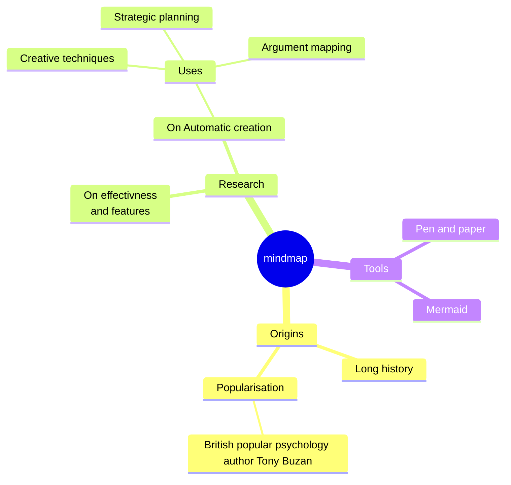
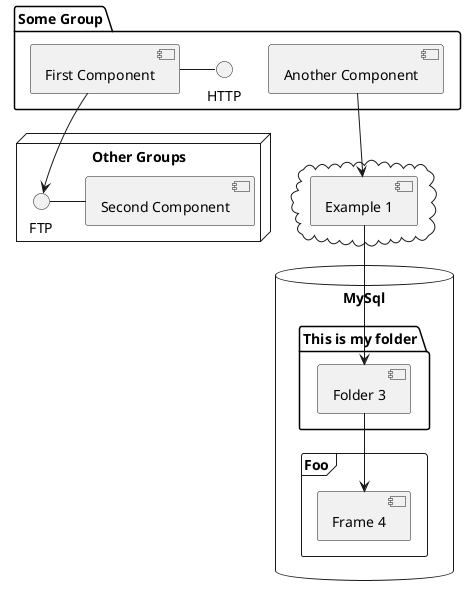

<style>
.slidev-layout.cover {
  background-image: linear-gradient(rgba(0, 0, 0, 0), rgba(0, 0, 0, 0)), url(/intro.png) !important; 
}
</style>
---
layout: default
---

<div>
  
</div>


---
transition: fade-out
layout: image-right
image: ./shiwa-id-Uae7ouMw91A-unsplash.jpg
---

# Native App First

Create a native app first as primary user experience of your app

<br>

```text {all|1|3|5|7|all}
💅🏻 Richer UI Interface

💪 More Computation Power

🔎 Easy to Find on Stores

📱 Easy to Start/Open
```
---
transition: fade-out
layout: image-right
image: ./faizur-rehman-dJpupM4LiS4-unsplash.jpg
---
# But Web Applications Evolved...

Thanks to PWAs, web applications became very similar to mobile apps

<br>

<cite>
A progressive web app (PWA) is an app that's built using web platform technologies, but that provides a user experience like that of a platform-specific app.
<br><br>Mozilla Docs
</cite>

---
layout: default
---
<div grid="~ cols-3 gap-6">

  <div>
    <div v-click="1">
      
    </div>
    <div v-click="2">
      <div class="size_1">
        
      </div>
    </div>
  </div>
  
  <div>
    
  </div>

  <div>
    <div v-click="1">
      
    </div>
    <div class="size_2" v-click="2">
      <div>
        
      </div>
    </div>
  </div>
</div>

<style>
img {
  width: 100%
}
.size_1 {
    position: absolute;
    bottom: 120px;
    left: 110px;
    width: 200px;
}
.size_2 {
    position: absolute;
    bottom: 120px;
    right: 75px;
    width: 200px;
}
</style>


---
transition: fade-out
layout: image-left
image: ./sarah-dorweiler-QeVmJxZOv3k-unsplash.jpg
---


# Web Application's Extra Benefits

<br>

```text {all|1|3|5|7|9|11|all}
✅ No store approval dependencies 

🛠️ Easier to mantain

💰 Lower development costs

🪽 Smaller memory footprint

🏎️ Faster live on the market

👯‍♂️ Not bound to one OS
```

<!--
You can have `style` tag in markdown to override the style for the current page.
Learn more: https://sli.dev/guide/syntax#embedded-styles
<style>
h1 {
  background-color: #2B90B6;
  background-image: linear-gradient(45deg, #4EC5D4 10%, #146b8c 20%);
  background-size: 100%;
  -webkit-background-clip: text;
  -moz-background-clip: text;
  -webkit-text-fill-color: transparent;
  -moz-text-fill-color: transparent;
}
</style>
-->

---
transition: fade-out
layout: image
image: ./managelayout.png
---

---
transition: fade-out
layout: default
---

# Web Manifest

<br> 

```html {all|3}
<html lang="en">
  <head>
    <link rel="manifest" href="manifest.json" />
    <!-- ... -->
  </head>
  <body></body>
</html>
```

<!-- The manifest contains a single JSON object containing a collection of members, each of which defines some aspect 
of the PWA's appearance or behavior. Here's a rather minimal manifest, containing just two members: "name" and "icons". -->

---
layout: default
---

# Web Manifest
<br> 

```json {all|2-3|6|7|8|9-22|all}
{
  "name": "angular-pwa",
  "short_name": "angular-pwa",
  "theme_color": "#1976d2",
  "background_color": "#fafafa",
  "display": "standalone",
  "scope": "./",
  "start_url": "./",
  "icons": [
    {
      "src": "assets/icons/icon-192x192.png",
      "sizes": "192x192",
      "type": "image/png"
      "purpose": "maskable"
    },
    {
      "src": "assets/icons/icon-512x512.png",
      "sizes": "512x512",
      "type": "image/png",
      "purpose": "maskable"
    }
  ]
}
```

<div v-click>
  
</div>

<arrow v-click x1="460" y1="480" x2="590" y2="480" color="#e9ff00" width="3" arrowSize="1" />

<style>
img {
  position: absolute;
  top: 20px;
  right: 115px;
  width: 250px;
}

.slidev-vclick-target {
  transition: opacity 200ms ease;
}

.slidev-vclick-hidden {
  opacity: 0;
  pointer-events: none;
}
</style>

---
layout: default
---

# Shortcuts

We can add <i>shortcuts</i> to the web manifest to enhance the user's engagement

<br>

<div grid="~ cols-2 gap-6">

  

  <div v-click>
    
  </div>
</div>

<style>
.slidev-layout {
  padding-top: 0;
}

img {
  height: 100%;
  width: 250px;
}
</style>

<!--
Presenter note goes here
-->

---
transition: fade-out
layout: image
image: ./manageperf.png
---

---
transition: fade-out
layout: default
---

# Service Workers & Caching Strategies

<br>

Service Workers allow to optimise our web applications, introducing:
<br><br>

<div v-click>
  <h4> ✅ Local Caching for static assets and network requests</h4>
</div>
<br>

<div v-click>
 <h4> ✅ Offline Capabilities</h4>
</div>

---
transition: fade-out
layout: default
---

# Registering a Service Worker

<br>

```ts
  if ("serviceWorker" in navigator) {
    try {
      const registration = await navigator.serviceWorker.register("/serviceWorker.js", {
        scope: "/",
      });
      if (registration.installing) {
        // Service worker is installing...

      } else if (registration.waiting) {
        // Service worker is now installed and waits to be activated!

      } else if (registration.active) {
        // Service worker has been actived.
      }
    } catch (error) {
      console.error(`Registration failed with error: ${error}`);
    }
  }
```

---
transition: fade-out
layout: default
---

# Caching Strategies
We can implement different strategies according to our needs:
<br><br>

<div v-click>
  <h5><b>Cache First</b>: maximize performance & allows offline behaviour</h5>
</div>
<br>

<div v-click>
 <h5><b>Network First</b>: preference for fresh data, but allows to fallback to cache</h5>
</div>
<br>

<div v-click>
 <h5><b>Stale While Revalidate</b>: hybrid solution, allowing quick responses with <i>fresher</i> data</h5>
</div>

<style>
  b {
    color: var(--slidev-theme-primary);
  }
</style>

---
transition: fade-out
layout: default
---

# Stale While Revalidate

```ts {all|5-6|17|7-14|17|all}
    self.addEventListener('fetch', (event) => {
      event.respondWith(
        (async function () {

          const cache = await caches.open('cache_V1');
          const cachedResponse = await cache.match(event.request);
          const serverResponsePromise = fetch(event.request);

          event.waitUntil(
            (async function () {
              const serverResponse = await serverResponsePromise;
              await cache.put(event.request, serverResponse.clone());
            })(),
          );

          // Provide the response in teh cache if available or fetch it from the server, otherwise.
          return cachedResponse || serverResponsePromise;
        })(),
      );
    });
```
   
  
 <!-- https://web.dev/stale-while-revalidate/ -->

 <style>
img {
  position: absolute;
  top: 100px;
  right: 60px;
  width: 330px;
}
</style>

---
transition: fade-out
layout: image
image: ./demooffline.png
---

---
layout: default
---
# END

---
layout: default
---

# Code

Use code snippets and get the highlighting directly![^1]

```ts {all|2|1-6|9|all}
interface User {
  id: number
  firstName: string
  lastName: string
  role: string
}

function updateUser(id: number, update: User) {
  const user = getUser(id)
  const newUser = { ...user, ...update }
  saveUser(id, newUser)
}
```

<arrow v-click="3" x1="400" y1="420" x2="230" y2="330" color="#564" width="3" arrowSize="1" />

[^1]: [Learn More](https://sli.dev/guide/syntax.html#line-highlighting)

<style>
.footnotes-sep {
  @apply mt-20 opacity-10;
}
.footnotes {
  @apply text-sm opacity-75;
}
.footnote-backref {
  display: none;
}
</style>

---

# Components

<div grid="~ cols-2 gap-4">
<div>

You can use Vue components directly inside your slides.

We have provided a few built-in components like `<Tweet/>` and `<Youtube/>` that you can use directly. And adding your custom components is also super easy.

```html
<Counter :count="10" />
```

<!-- ./components/Counter.vue -->
<Counter :count="10" m="t-4" />

Check out [the guides](https://sli.dev/builtin/components.html) for more.

</div>
<div>

```html
<Tweet id="1390115482657726468" />
```

<Tweet id="1390115482657726468" scale="0.65" />

</div>
</div>

<!--
Presenter note with **bold**, *italic*, and ~~striked~~ text.

Also, HTML elements are valid:
<div class="flex w-full">
  <span style="flex-grow: 1;">Left content</span>
  <span>Right content</span>
</div>
-->


---
class: px-20
---

# Themes

Slidev comes with powerful theming support. Themes can provide styles, layouts, components, or even configurations for tools. Switching between themes by just **one edit** in your frontmatter:

<div grid="~ cols-2 gap-2" m="-t-2">

```yaml
---
theme: default
---
```

```yaml
---
theme: seriph
---
```


</div>

Read more about [How to use a theme](https://sli.dev/themes/use.html) and
check out the [Awesome Themes Gallery](https://sli.dev/themes/gallery.html).

---
preload: false
---

# Animations

Animations are powered by [@vueuse/motion](https://motion.vueuse.org/).

```html
<div
  v-motion
  :initial="{ x: -80 }"
  :enter="{ x: 0 }">
  Slidev
</div>
```

<div class="w-60 relative mt-6">
  <div class="relative w-40 h-40">
    
    
    
  </div>

  <div
    class="text-5xl absolute top-14 left-40 text-[#2B90B6] -z-1"
    v-motion
    :initial="{ x: -80, opacity: 0}"
    :enter="{ x: 0, opacity: 1, transition: { delay: 2000, duration: 1000 } }">
    Slidev
  </div>
</div>

<!-- vue script setup scripts can be directly used in markdown, and will only affects current page -->
<script setup lang="ts">
const final = {
  x: 0,
  y: 0,
  rotate: 0,
  scale: 1,
  transition: {
    type: 'spring',
    damping: 10,
    stiffness: 20,
    mass: 2
  }
}
</script>

<div
  v-motion
  :initial="{ x:35, y: 40, opacity: 0}"
  :enter="{ y: 0, opacity: 1, transition: { delay: 3500 } }">

[Learn More](https://sli.dev/guide/animations.html#motion)

</div>

---

# LaTeX

LaTeX is supported out-of-box powered by [KaTeX](https://katex.org/).

<br>

Inline $\sqrt{3x-1}+(1+x)^2$

Block
$$
\begin{array}{c}

\nabla \times \vec{\mathbf{B}} -\, \frac1c\, \frac{\partial\vec{\mathbf{E}}}{\partial t} &
= \frac{4\pi}{c}\vec{\mathbf{j}}    \nabla \cdot \vec{\mathbf{E}} & = 4 \pi \rho \\

\nabla \times \vec{\mathbf{E}}\, +\, \frac1c\, \frac{\partial\vec{\mathbf{B}}}{\partial t} & = \vec{\mathbf{0}} \\

\nabla \cdot \vec{\mathbf{B}} & = 0

\end{array}
$$

<br>

[Learn more](https://sli.dev/guide/syntax#latex)

---

# Diagrams

You can create diagrams / graphs from textual descriptions, directly in your Markdown.

<div class="grid grid-cols-4 gap-5 pt-4 -mb-6">









</div>

[Learn More](https://sli.dev/guide/syntax.html#diagrams)

---
src: ./pages/multiple-entries.md
hide: false
---

---
layout: center
class: text-center
---

# Learn More

[Documentations](https://sli.dev) · [GitHub](https://github.com/slidevjs/slidev) · [Showcases](https://sli.dev/showcases.html)
